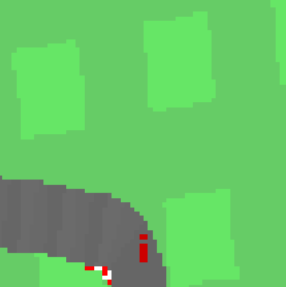
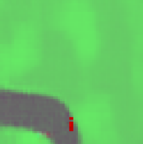
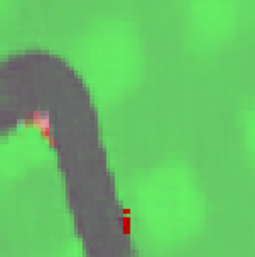

# World Models
This repo is based off the [original implemmentation](https://github.com/hardmaru/WorldModelsExperiments) of [World Models](https://arxiv.org/abs/1803.10122). This implementation is written in Tensorflow-2.1. 

## Docker
The easiest way to handle dependencies is with [Nvidia-Docker](https://github.com/NVIDIA/nvidia-docker). Follow the instructions below to generate and attach to the container.
```
docker image build -t wm:1.0 -f docker/Dockerfile.wm .
docker container run --gpus '"device=0"' --detach -it --name wm wm:1.0
docker attach wm
```

## Visualizations
To visualize the environment from the agents perspective or generate synthetic observations use the visualizations jupyter notebook 

Sample of a real frame.



Reconstruction of the real frame. This can be thought of as what the agent sees.



This is an entirely imagined frame that never existed.



A gif of a reconstructed trajectory. 


## Reproducing Results From Scratch
1) To reproduce results, run the extract.bash script to generate 10k trajectories
```
bash extract.bash
```
After generating the trajectories, train the Variational Auto Encoder
```
python vae_train.py
```
Prepare embeddings for training the MDN-RNN
```
python series.py
```
Train the MDN-RNN
```
python rnn_train.py
```
Finally train the controller
```
bash gce_train.bash
```

## Disclaimer
I have not run this for long enough(~45 days wall clock time) to verify that we produce the same results on CarRacing-v0 as the original implementation. 
