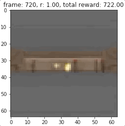
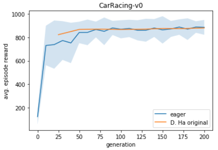

# World Models
This repo reproduces the [original implementation](https://github.com/hardmaru/WorldModelsExperiments) of [World Models](https://arxiv.org/abs/1803.10122). This implementation uses TensorFlow 2.2.

## Docker
The easiest way to handle dependencies is with [Nvidia-Docker](https://github.com/NVIDIA/nvidia-docker). Follow the instructions below to generate and attach to the container.
```
docker image build -t wm:1.0 -f docker/Dockerfile.wm .
docker container run -p 8888:8888 --gpus '"device=0"' --detach -it --name wm wm:1.0
docker attach wm
```

## Visualizations
To visualize the environment from the agents perspective or generate synthetic observations use the [visualizations jupyter notebook](WorldModels/visualizations.ipynb). It can be launched from your container with the following:
```
jupyter notebook --no-browser --port=8888 --ip=0.0.0.0 --allow-root
```

Real Frame Sample             |  Reconstructed Real Frame  |  Imagined Frame
:-------------------------:|:-------------------------:|:-------------------------:|
|  | 

Ground Truth (CarRacing)             |  Reconstructed
:-------------------------:|:-------------------------:
 | 

Ground Truth Environment (DoomTakeCover)   |  Dream Environment
:-------------------------:|:-------------------------:
 | 

## Reproducing Results From Scratch
These instructions assume a machine with a 64 core cpu and a gpu. If running in the cloud it will likely financially make more sense to run the extraction and controller processes on a cpu machine and the VAE, preprocessing, and RNN tasks on a GPU machine.

### DoomTakeCover-v0
To reproduce results for DoomTakeCover-v0, collect trajectories with
```
bash doom_extract.bash
```
[OPTIONAL] The doom environment leaves some processes hanging around so you may want to free up memory with the following (be careful with this if you are not running in a container)
```
pkill -9 -f vizdoom
```

Then launch the training and data preparation processes with
```
bash doom_train.bash
```

### CarRacing-v0
To reproduce results for CarRacing-v0 run the following bash script
```
bash carracing_experiments.bash
```

## Disclaimer
I have not run this for long enough(~45 days wall clock time) to verify that we produce the same results on CarRacing-v0 as the original implementation.

Average return curves comparing the original implementation and ours. The shaded area represents a standard deviation above and below the mean. 



For simplicity, the Doom experiment implementation is slightly different than the original
* We do not use a modified LSTM cell 
* We do not us weighted cross entropy loss for done predictions
* We do not adjust temperature (\tau) for training in dreams 
* We sample sequences for rnn training differently

|  | generation | \tau | Returns Dream Environment  &nbsp;&nbsp;&nbsp;&nbsp;&nbsp;&nbsp;| Returns Actual Environment  &nbsp;&nbsp;&nbsp;&nbsp;&nbsp;&nbsp;
|------|------|------|------|------|
|   D. Ha Original  | 2000 | 1.0 | 1145 +/- 690 | 868 +/- 511 |
|   Eager  | 200 | 1.0 | 1182 +/- 689 | 867 +/- 557 |
